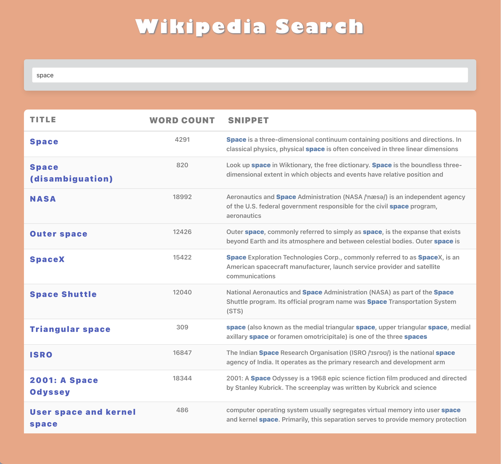

# WikiSearch-Angular 

  ## Description

  An application where you can conduct Wikipedia searches and results are displayed in a table. Click on the article title in the table to see open a new tab with the full Wikipedia article rendered.

  Screenshot:
  
  
  ## Table of Contents
  
  - [Installation](#installation)
  - [Usage](#usage)
  - [License](#license)
  - [Contributing](#contributing)
  - [Tests](#tests)
  - [Questions](#questions)
  
  ## Installation
  
  Deployed URL:
  
  ## Usage
  
  Enter a search term and see results rendered on the page. Click on a title to see the full Wikipedia article.

  ## License
This application is covered under the MIT License.
 For more information: https://opensource.org/licenses/MIT
  
  ## Contributing
  N/A
  
  ## Tests
  N/A

  ## Questions
  Contact Info 
  GitHub user name: BillStephens2022 
  Link to GitHub profile: https://github.com/BillStephens2022 
  Email: stephensbill17@gmail.com

